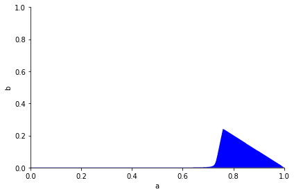
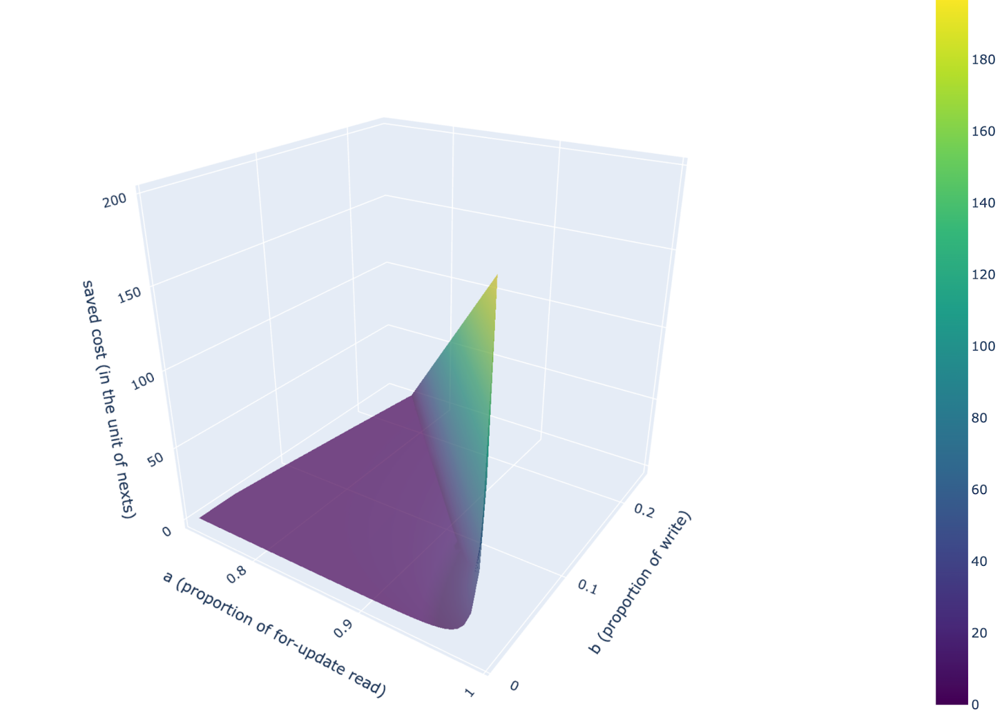
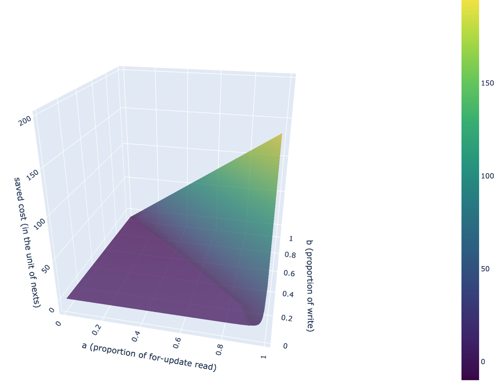

# [publicly available] WRITE CF & LOCK CF discussion

## Background

- Many MVCC records reside in WRITE CF. Read (point-get and scan) performance can degrade as versions increase.
- Many tombstones reside in LOCK CF, causing waste of resources for compaction.
  - Most of the time each transaction does: read -\> put -\> delete, in-place
  - There is at most 1 version for a lock.
- Future adoption of [user-defined timestamp](https://github.com/facebook/rocksdb/wiki/User-defined-Timestamp-%28Experimental%29)s may affect the designs. The following discussion doesn't take it into account.

Several solutions are available, let's choose a set of them to implement.

**Objectives**

1. Don't let lock records in WRITE CF slow point-get or range query.
2. Speed up point-get/scan operations for the latest versions, as well as the transaction status checking or conflict checking operations.
3. Minimize compaction in LOCK CF, make the lock cf related operations in-memory as possible.
4. Refactor some previous tricky implementations like the same key with ROLLBACK and WRITE type and related gc compaction filter logic.
5. Support transaction [anchor key](https://github.com/cockroachdb/cockroach/blob/be76f27b89169fb42e6a945ce36e4d52ecbbd9fb/pkg/storage/engine/enginepb/mvcc3.pb.go#L39) to resolve primary key issue like [unused key is locked as primary](https://github.com/pingcap/tidb/issues/35682). Would some sort of transaction cache help both objective 5 and objective 2?

**Intuitives**

- LSM tree is not the best choice for LOCK CF
- In-place updates =\> memtable compaction =\> somewhat single-delete?
- Write::lock records are necessary for the transaction protocol. So the only way to overcome its impact on read performance is either (1) Do not read through these records =\> cache? (2) Fewer records (3) faster read (like ridge pointers? but only for in-memory structures)
- Scan(with given ts) can hardly be optimized
  - Best case: unless we have a data structure that captures all data in the given range, which is infeasible.
  - Scanning fewer versions in WRITE CF.
- Single delete can replace normal delete on version\_encoded key (all of those in WRITE CF)?

## Candidate solutions

### **Change lock to put/delete for unique indexes**

Related issues:

For existent key [https://github.com/pingcap/tidb/issues/25659](https://github.com/pingcap/tidb/issues/25659)

For non-existent key [https://github.com/pingcap/tidb/issues/33393](https://github.com/pingcap/tidb/issues/33393)

Pull requests:

Change to PUT [https://github.com/pingcap/tidb/pull/25730](https://github.com/pingcap/tidb/pull/25730)

#### Advantage

Easy to implement. Solve the point-get performance issue.

#### Drawback

No obvious drawbacks are found for now. Essentially locks could be _lighter_ than PUT/DELETE in the sense that they do not mutate data, which is the exact motivation to create a separate CF for lock records.

If the value fits in short\_value, there is little impact on write performance.

If the value doesn't fit in short\_value and requires an extra write in DEFAULT CF, its impact could be remarkable. _We should verify this claim_.

### **Premature idea: let write::lock point to a record in DEFAULT CF**

so that write::locks doesn't have to be put, and they don't slow a point-get.

Drawback: GC needs to be modified. Current GC assumes WRITE and DEFAULT records are 1-to-1.

### **Single delete for lock cf**

[single delete](https://github.com/facebook/rocksdb/wiki/Single-Delete)

prerequisite:

The key exists and was written only once (no overwriting), otherwise undefined behavior.

> SingleDelete() only behaves correctly if there has been only one Put() for this _key_ since the previous call to SingleDelete() for this _key_.

#### Advantage

LOCK CF should become quite small then.

#### Drawback

The only risk here is to use single delete rightly.

Extra single deletes might be needed to satisfy its prerequisite.

#### Estimated impact

LOCK CF can hold 32MB/670byte/2 = 23880 transactions, which is much larger than T. So for most transactions, the PUT and DELETE of locks of them should reside in the same memtable. And single\_delete should be able to remove them when flushing.

SpadeA-Tang's trial:

[https://github.com/tikv/tikv/pull/12312](https://github.com/tikv/tikv/pull/12312)

### **In-memtable compaction?**

Remove LOCK CF tombstones before flushing.

Reference: [https://github.com/tikv/tikv/issues/8140](https://github.com/tikv/tikv/issues/8140)

#### Advantage

LOCK CF should be small.

#### Drawback

It's more complicated. Seems it's superseded by the single delete solution if we only target LOCK CF.

### **New CF for write::lock & write::rollback**

Move write::lock and write::rollback to the new CF.

#### Advantage

Fewer versions in WRITE CF.

It benefits all kinds of read. But it requires one more read in ROLLBACK CF for conflict check.

#### Drawback

Assume each version is read R times, and there are an average of L lock records for each PUT version of a key before the actual data is found.

It saves R * L nexts, and costs at most one (iterator creation + seek) for conflict check.

So it's not beneficial for all scenarios.

#### A variant

For write::lock, write to both ROLLBACK CF and WRITE CF.

For any kind of write in WRITE CF, if its previous record is a lock, delete it.

So for each key at most 1 write::lock can reside in WRITE CF, which is the latest version.

This is similar to "collapsing lock in WRITE CF", but there are copies in ROLLBACK CF.

#### Advantage

Conflict check only needs to seek WRITE CF.

#### Drawback

It introduces 1 extra put and 1 deletion for each write::lock.

Besides performance, there may be more versions left before the deletion is compacted into the lowest level.

Single delete may help, but cannot completely solve it.

#### Estimated impact

Consider the general case:

Each for-update read appends a LOCK. Each write appends a PUT.

Assume the possibility of a for-update read operation is $a$ , write is $b$, and normal read is $(1-a-b)$.

What's the expected length of the sequence of LOCKS in front of the first PUT when a read happens?

$\sum_i iba^i = ab/(1-a)^2$

The estimate is optimistic because the first version might not be what we want.

Moving all locks to another CF would:

- save at least $ab/(1-a)^2$ next for read operations.
- cost an extra iterator creation and a seek for write operations for conflict check.

Assume an iterator creation plus a seek is **10x** more expensive than a next.

When can we benefit from the new CF?

$(1-b)*ab/(1-a)^2 > b * 10$ =\> the blue area:



If we take a `next` as the unit to measure cost, the expected benefit would look like this.



If we consider how the new CF can harm performance in other workloads:


The overview:



To conclude

1. **When the distribution of the workload lies in the blue area (counting in key level), an extra CF results in a better overall performance.** Even if there are 1% writes, there must be at least 75% for-update read to make the new CF benefit.
2. For workloads with quite a lot of for-update read operations, the solution can drastically improve overall performance
3. For other workloads, the new CF harms performance, to the extent that is approximately proportional to b (the proportion of write operations). a (the proportion of for-update read operations) doesn't affect much.

Best case scenario: pure for-update read, no write. Drastically better performance.

Worst case scenario: pure write, no read. Each write operation has to perform an extra iterator creation and a seek.

This is a quite rough estimation. Several factors are ignored here

- The first PUT may not be the version we want when contention is intensive
- The version sequence is limited because of GC
- seek in LOCK&ROLLBACK CF could be different from seek in WRITE

#### The variant: write locks in both CFs

There may be at most 1 write::lock in WRITE CF, we just ignore it as a cost.

If there are few locks to write, then the variant is better for not introducing the extra read during conflict check.

If most write operations are locks, the overhead of extra writes and tombstones is not worth it. It can even make things worse.

We need to know the precise effect of "collapsing", namely "put-(single)delete" patterns to evaluate the impact of the variant.

### **New CF: LATEST CF**

[https://github.com/tikv/rfcs/pull/95](https://github.com/tikv/rfcs/pull/95)

A new CF that contains the latest version of each key.

#### Advantage

Point-getting the latest version requires only 1 `get`.

Conflict check is faster (from a seek to a get)

#### Drawback

But it needs extra effort to maintain LATEST CF.

But if a key is written only once, it only modifies LATEST CF and doesn't introduce overhead.

#### Estimated impact

| operation                                  | cost                                                         | diff                                                         |
| ------------------------------------------ | ------------------------------------------------------------ | ------------------------------------------------------------ |
| insertion of a previously non-existent key | only writes LATEST CF. read LATEST                           | seek write -> get latest                                     |
| update or deletion of an existent key      | writes both LATEST and WRITE. read LATEST                    | an extra write. seek write -> get latest                     |
| for-update read                            | writes both LATEST and WRITE. read LATEST and possibly WRITE | an extra write. latest is satisfactory. seek -> get otherwise (seek + n * next) -> (get + seek + n * next) |
| latest read                                | get LATEST                                                   | seek (+ n*next) -> get                                       |
| normal read (point-get and scan)           | read LATEST and possibly WRITE                               | latest is satisfactory. seek -> get otherwise (seek + n * next) -> (get + seek + n * next) |

Assume there are **few contentions**.

The workload consists of $x$ insertions, $y$ update/deletions, $z$ for-update reads, $u$ latest reads, and $(1-x-y-z-u)$ normal read.

Let $G$ denote the cost of a get, $S$ denote the cost of an iterator creation + a seek, $W$ denote the cost of a write to LATEST CF, and $a$ denote the possibility of the case that the latest version satisfies the read.

Assume $S = 10G$.

The expected diff = $[(10a-10)x+(10a-10)y+(10a-10)u-10a+1]G + (y+z)W$

For read, it almost always has benefit, even in the high contention workload ($a=0.01$)

Worst case: $x = 0, y = 0, z = 1, u = 0, a = 0$. diff = $G + W$

Best case: $x + u = 1, y = 0, z = 0, a = 1$. diff = $-9G$

To summarize:

It's hard to tell when to enable LATEST CF. We can use a conservative strategy: use LATEST CF only when $(y+z)$ is small and a is large, which means read-write contention is low and most operations are append-like or normal read.

### **In-memory cache**

General idea: let "hot spot" be processed in memory. Current usage of block cache is not efficient as there may be many useless versions. And we use our cache that is specialized for TiKV's usage pattern.

There can be many design decisions:

1. Role

2. 1. Cache aside. Doesn’t affect the write path at all, except that a write also updates the cache. Read can go for the cache first.
   2. Cache in front of kvdb. Leave kvdb unchanged. Write first goes into the cache.
   3. Replace memtable in kvdb. Use a large memtable, so that in-place update and read could happen in memory and don’t have to go to disk.
   4. The 2nd memtable in kvdb. Cold data goes to the original memtable. Hot data goes into this.

3. Structure

4. 1. B+ tree. Good for scan
   2. Skiplist. Good for scan.
   3. Hashtable. Good for point-get. Scan is impossible

5. Keyspace of the cache

6. 1. Limited regions or ranges

   2. 1. How to choose them and replace them when needed?

   3. Unlimited, i.e. all regions in the current TiKV

7. Versions in the cache

8. 1. latest version (commit ts)
   2. lock
   3. lock + latest write
   4. lock + recent writes
   5. lock + full mvcc history

9. When the cache is too large

10. 1. Evict some region or key range or page
    2. Dump whole content

11. Where to dump?

12. 1. kvdb
    2. l0 file in kvdb (when it is the memtable)
    3. Self-maintained disk storage, e.g. some kind of b-tree engine

13. WAL

14. 1. Write its own WAL

    2. 1. Async commit requires LOCK CF to be persistent. So we cannot apply the FORCE policy: before returning the commit response, guarantee its data has been applied in kvdb.

    3. If it is memtable in kvdb, share the original kvdb WAL

15. Initialization

16. 1. Init on read: at first, the cache is empty. Cache miss results in a read to kvdb and stores it in the cache. “delete” must be kept in the cache.
    2. Full load when initialized. There won’t be cache misses (a cache miss means non-existence).

These decisions are interrelated. For example, if we store the whole keyspace in the cache, then it surely dumps the whole content.

Oceanbase seems like: "replace" memtable + "B+ tree + hashtable" + unlimited keyspace + Dump to l0 file + FORCE.

One simple solution to solve the LOCK CF problem might be: cache in front of kvdb + hashtable + unlimited keyspace + LOCK CF ONLY + dump to kvdb.

Another simple optimization proposed by @sticnarf is an in-memory cache just for conflict checks. The cache is an LRU mapping key to the latest version number (commit\_ts). For hot update workloads, it can save a seek in WRITE. It could also be combined with other solutions to reduce the cost of conflict checks, e.g. LOCK&ROLLBACK CF. LOCK CF could be cached to speed up load\_lock as well.

More complex variations could be like: replace memtable / 2nd memtable + (B+ tree + hashtable) + hot regions + (lock + full mvcc history) + dump to l0. It is then essentially an in-memory database so that hot regions are handled in-memory.

### **Modify memtable so that it supports "get latest key" and "scan latest range"(This doesn't seem natural)**

We modify RocksDB to make it _somewhat_ understand TiKV encoding. Implement methods like `get_latest_key_in_memtable`.

#### Advantage

Speed up point-get the latest version by saving the cost of creating iterators and seek

#### Drawback

The latest version may not be in memtable. The benefit is uncertain.

#### Estimated impact

The example workload is uniformly distributed. 128MB / (527+173) bytes = 183K transactions. That means at most 183K\*2=366K lines with its latest write record is in memtable.

Assume the cardinality of the keyspace is m.

The expected number of saved seeks in a uniformly distributed workload is 366K / m. In the example workload, it's 366K / 10M = 3.7%.

In a skewed distribution, for example, a counter-like workload, it is almost always able to find the latest version in memtable.

### **Collapse(fold) write::lock records, just like rollback records.**

Similar to collapse rollback records, collapse lock records.

#### Advantage

A consecutive sequence of put\_lock records becomes a sequence of tombstones plus a put\_lock, and finally a single put\_lock.

#### Drawback

**Incompatible with async commit** because the check\_secondary\_keys need some information to determine the status of secondary keys.

Lock records on primary keys are kept. This can be _dirty_.

Question: what's the accurate benefit of collapsing rollback records?

### **Collapse lock variant 1: TXN CF**

A mad idea to bypass this problem.

Motivation: let WRITE CF be the conflict watermark. The rest function of a write::lock record is for async commit to determine txn status. We explicitly store txn status instead.

To solve these problems, we add a TXN CF: start\_ts -\> (status, keys). Keys are all keys locked in this transaction in the current region. Each region has its own TXN CF. A start\_ts can appear in multiple TXN CFS, i.e. in multiple regions. TXN CF only stores collapsed locks.

When a write::lock is written, also write TXN CF.

When any write happens in WRITE CF, if its previous record is a write::lock, delete it, and remove it in its corresponding TXN CF entry. Remove the entry when the keys are all gone.

Check\_secondary\_keys read both TXN CF and WRITE CF.

Region merge: merge keys, pick the more advanced status.

Region split: divide keys

GC: GC entries whose keys are all removed and it's behind GC safepoint.

#### Advantage

There is at most 1 write::lock in write CF.

#### Drawback

Not suitable for txns with many locks. So we apply the behavior only for txns with less than 16 locks.

1 more (get and?) write in TXN CF for each write::lock.

Resolving may need to do more read.

### **Collapse lock variant 2: exponential merge**

Let each write contain up to N version numbers(and corresponding rollback overlap flags) that indicate the collapsed lock records.

When check\_txn\_status or check\_secondary\_keys, the scan works as before. We just extract these version numbers and view them as writes.

To reduce write amplification, the hybrid strategy can be used. The algorithm is like

- First, we add 2 optional fields in write: (1) an array of collapsed start\_ts (and overlapped rollback flags) (2) single\_lock\_len: the current length of consecutive _single_ lock records
- When writing a lock new record in WRITE CF
  - If there are enough consecutive single lock records, delete the previous ones, merge them with current write. And recursively merge with adjacent lock records with the same size.
    - For example, let merge threshold=2, there are sequences of lock records: 16, 8, 4, 2. At this time, single\_lock\_len is 0. So writing a record doesn't trigger a merge. The result is 16,8,4,2,1. And we write a lock again, this time there will be 2 consecutive single lock records after the write. So we backtrace the chain and find 16, remove all these records and write a new lock record that contains all of the 32 locks.
  - If there are not enough consecutive single lock records, just write a new one.
- When writing a non-lock record in WRITE CF
  - Delete the previous consecutive lock records, and merge them into this new record.
- There is a hard limit N indicating the largest number of locks in a record

The two strategies handle both long lock chains and short interleaving lock records.

Worst case:

Write amplification is at most logN.

The number of lock records is at most 1/N of the original number for chains with length \>= N. For shorter chains, the number of locks becomes at most 1/logN of the number before.

To reduce write amplification, we could consider compressing the timestamps.

#### Advantage

Good compatibility with the current implementation. The parameters can even be dynamic to fit the change of workload.

The number of write::lock should be at most 1/N of what it was before.

#### Drawback

- Write amplification of logN at worst.
- Each write::lock introduces an extra delete, thus having the same tombstone issue with similar solutions.
- Values of write records can be larger. However we only add about 9N bytes, if N is chosen wisely, it shouldn't make values too large.

Another premature idea: fold backward, not forward. It needs to mitigate the cost of resolving process.

### **Use single delete for `delete_write` (for now, only collapsing rollback and GC)**

#### Advantage

If a single delete is not more expensive than a normal delete, it should help reduce versions in WRITE CF, to an _unclear_ extent.

It may be combined with other solutions to mitigate their disadvantages.

#### Drawback

The only risk here is to use single delete rightly.

Extra single deletes might be needed to satisfy its prerequisite.

## Comparison

[[publicly available] WRITE CF & LOCK CF candidate optimization comparision](https://docs.google.com/spreadsheets/d/12CqoZkzArXPrpKWMrB2hYttIpEszTIeuAwL5CcnkIUw/edit#gid=0)

## Exemplar data used for analysis

Some analysis above uses the data and workload described below:

Assume:

The key is 150 bytes long, plus an 8-byte timestamp.

Value:

- LOCK CF: 60 + PK\_len(150) + amortized secondaries(10 + key\_len) = 370 bytes
- WRITE CF PUT/DELETE: \<= 23 bytes
- WRITE CF LOCK: 20 bytes
- DEFAULT CF: vlen

We run the default sysbench oltp\_read\_write workload on a cluster with 3 TiKV, with a total of 10M rows. Denote the proportion of point\_select, range\_select, update\_index, update\_non\_index is a, b, c, d, respectively. a+b+c+d=1.

```sql
CREATE TABLE `sbtest1` (
  `id` int(11) NOT NULL AUTO_INCREMENT,
  `k` int(11) NOT NULL DEFAULT '0',
  `c` char(120) NOT NULL DEFAULT '',
  `pad` char(60) NOT NULL DEFAULT '',
  PRIMARY KEY (`id`) /*T![clustered_index] CLUSTERED */,
  KEY `k_1` (`k`)
) ENGINE=InnoDB DEFAULT CHARSET=utf8mb4 COLLATE=utf8mb4_bin AUTO_INCREMENT=2000001

```

A row is about 200 bytes long.

Update index:

`UPDATE sbtest1 SET k=k+1 WHERE id=?`

LOCK CF:

put row 150 + 370 = 520 bytes

delete row 150

670

WRITE CF:

put new index 150 + 23 = 173

put row 150 + 23 = 173

del old index 150 + 23 + 8 = 181

527 bytes total

Update non-index:

`UPDATE sbtest1 SET c=? WHERE id=?`

LOCK CF:

put row 520

delete row 150

670

WRITE CF:

put row 173

Assume there are T threads working. By default, LOCK CF memtable is 32 MB, WRITE CF is 128 MB.

## Proposed plan

_Can we accept a solution that drastically improves worst-case but causes slight performance regression for all workloads?_

_We need to find a combination of solutions, hopefully, they can solve each other's drawbacks._

## TODO

- **verify the impact of collapsing rollback records. It's critical to figure out the impact of tombstones since many optimizations use similar approaches.**
- verify the impact of changing LOCK to PUT, especially for large values
- benchmark the cost of next, get, iterator creation, and seek
- prototype and benchmark version LRU
- research user-defined timestamp